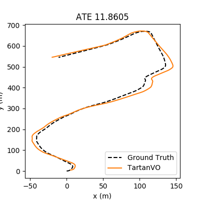
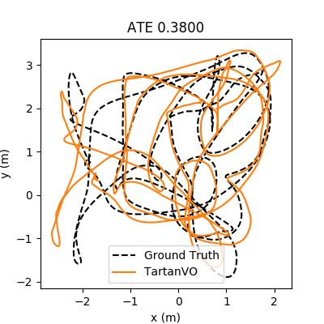
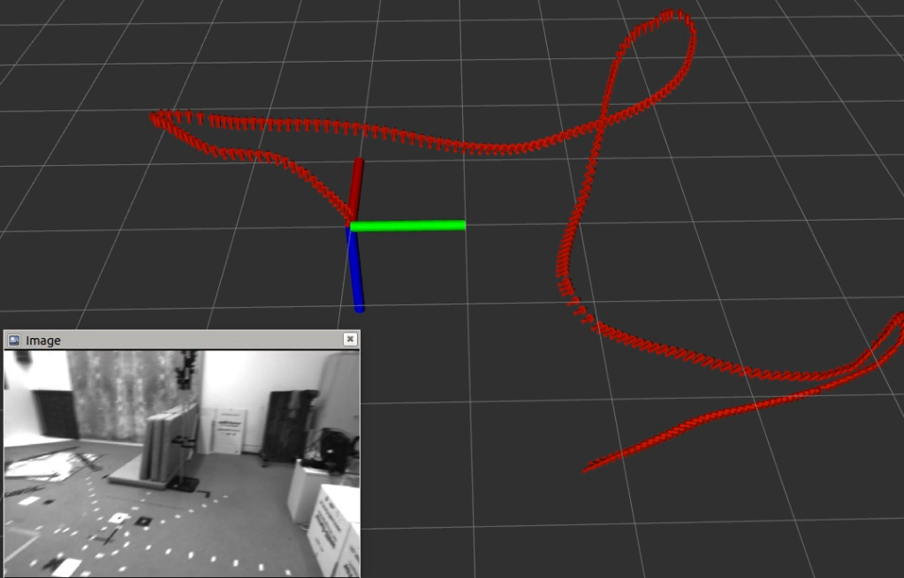

# TartanVO: A Generalizable Learning-based VO

TartanVO is a learning-based visual odometry trained on [TartanAir](https://theairlab.org/tartanair-dataset) dataset. It generalizes to multiple datasets and real-world scenarios, and outperforms geometry-based methods in challenging scenes. 

TODO: add a paper link and author info

## Example
Introduction video: [Youtube](https://www.youtube.com/watch?v=NQ1UEh3thbU)

TODO: Add another video source

Our model is trained purely on simulation data, but it generalizes well to real-world data. For example, these are the testing results on [KITTI-10](http://www.cvlibs.net/datasets/kitti/eval_odometry.php) and [EuRoC V102](https://projects.asl.ethz.ch/datasets/doku.php?id=kmavvisualinertialdatasets):

  

## Requirments
* Python 2 / 3
* numpy 
* matplotlib
* scipy
* pytorch >= 1.3
* opencv-python
* cupy

You can install the above dependencies manually, or use the following command:
```
$ pip install numpy matplotlib scipy torch==1.4.0 opencv-python==4.2.0.32 cupy==6.7.0
```

Our code has been tested on Ubuntu 18.04 and 16.04. An nvidia-driver and a Cuda version of 9.2/10.2 are required to run the code. If you have trouble installing these dependencies, please try the dockerfile we provide below. 

### Setting up the environment in the docker
We provide a [dockerfile](docker/tartanvo_ros.dockerfile), which allows you to replicate our setup. The docker image contains everything we need for testing this repo, including cuda, pytorch, cupy, opencv, ROS-melodic and etc. Here are a few steps to build the docker image. 

* Install docker and nvidia-docker. You can find online tutorials like [this](https://cnvrg.io/how-to-setup-docker-and-nvidia-docker-2-0-on-ubuntu-18-04/).
* Build the docker image. 
```
$ cd docker 
$ docker build -t tartanvo -f tartanvo_ros.dockerfile .
```
  Instead of building the docker image on your machine, you can also download our docker image from the dockhub
    `docker pull amigoshan/tartanvo`, which is built on a ubuntu machine with nvidia driver 440.100.

* Run the docker image and mount the tartanvo into the container.
```
nvidia-docker run -it --rm -v /PATH_TO_THIS_TARTANVO_REPO/tartanvo:/tartanvo tartanvo:latest
```
* Now it's all set. Continuing the following steps inside the container.


## Testing with a pretrained model
### Download the pretrained model

```
$ mkdir models
$ wget https://cmu.box.com/shared/static/t1a5u4x6dxohl89104dyrsiz42mvq2sz.pkl -O models/tartanvo_1914.pkl
```

### Download the testing data
  
* Download KITTI-10 testing trajectory
```
$ mkdir data
$ wget https://cmu.box.com/shared/static/nw3bi7x5vng2xy296ndxt19uozpk64jq.zip -O data/KITTI_10.zip
$ unzip -q data/KITTI_10.zip -d data/KITTI_10/
```
You can also download other trajectories from the [KITTI website](http://www.cvlibs.net/datasets/kitti/eval_odometry.php). First, each trajectory may have different intrinsics, make sure you change the values in `Datasets/utils.py`. Second, we are using the same format of pose file with the TartanAir dataset. You can use the `Datasets/transformation/kitti2tartan()` to convert the KITTI pose files. 

* Download EuRoC-V102 testing trajectory
```
$ mkdir data
$ wget https://cmu.box.com/shared/static/1ctocidptdv1xev6pjxdj0b782mrstps.zip -O data/EuRoC_V102.zip
$ unzip -q data/EuRoC_V102.zip -d data/EuRoC_V102/
```
You can download other trajectories from the [EuRoC dataset](https://projects.asl.ethz.ch/datasets/doku.php?id=kmavvisualinertialdatasets). What we did for the sample data EuRoC_V102 was the following:
- Undistort the image according to their calibration results.
- Match the images with the GT poses according to the timestamp.
- Change the intrinsics parameters in the code. 

Note the poses outputed by TartanVO are in the NED frame. 

### Alternative download links:
In case using the above links is slow, please try the following links from Azure. You can replace the links with the following ones. Instead of `wget`, using the [azcopy tool](https://docs.microsoft.com/en-us/azure/storage/common/storage-use-azcopy-v10) usually is much faster. 
* Model: https://tartanair.blob.core.windows.net/tartanvo/models/tartanvo_1914.pkl
* KITTI-10: https://tartanair.blob.core.windows.net/tartanvo/data/KITTI_10.zip
* EuRoC-V102: https://tartanair.blob.core.windows.net/tartanvo/data/EuRoC_V102.zip

<!--    * Download TartanAir-MH006 testing trajectory
   ```

   ```
 -->

### Run the testing script
The `vo_trajectory_from_folder.py` script shows an example of running TartanVO on a sequence of images out of a folder. Because TartanVO outputs up-to-scale translation, the script also reads a pose file for adjusting the translation scale. If the pose file is not provided, the default scale of 1.0 will be used. The results are stored in the `results` folder. 

- Testing on KITTI
```
$ python vo_trajectory_from_folder.py  --model-name tartanvo_1914.pkl \
                                       --kitti \
                                       --test-dir data/KITTI_10/image_left \
                                       --pose-file data/KITTI_10/pose_left.txt 
```
- Testing on EuRoC
```

$ python vo_trajectory_from_folder.py  --model-name tartanvo_1914.pkl \
                                       --euroc \
                                       --test-dir data/EuRoC_V102/image_left \
                                       --pose-file data/EuRoC_V102/pose_left.txt
```

<!-- - Testing on TartanAir -->

Running the above commands with the `--save-flow` tag, allows you to save intermediate optical flow outputs into the `results` folder. 

Adjust the batch size and the worker number by `--batch-size 2`, `--worker-num 2`. 

## Run the ROS node 

We provide a python ROS node in `tartanvo_node.py` for the easy integration of the TartanVO into robotic systems. 

### How does TartanVONode work?
1. Subscribed topics
   - rgb_image (sensor_msgs/Image): RGB image.
   - cam_info (sensor_msgs/CameraInfo): camera parameters which are used to calculate intrinsics layer. 
   - vo_scale (std_msgs/Float32): scale of the translation (should be published at the same frequncy with the image). If this is not provided, default value of 1.0 will be used. 

2. Published topics
   - tartanvo_pose (geometry_msgs/PoseStamped): position and orientation of the camera
   - tartanvo_odom (nav_msgs/Odometry): position and orientation of the camera (same with the `tartanvo_pose`).

3. Parameters: 
   We use the following parameters to calculate the initial intrinsics layer. If the `cam_info` topic is received, the intrinsics value will be over-written. 
   - image_width : image width
   - image_height : image height
   - focal_x : camera focal lengh
   - focal_y : camera focal lengh
   - center_x : camera optical center
   - center_y : camera optical center

### Run the ROS node
1. Open a ROS core:
```
$ roscore
```

2. Run the TartanVONode
```
$ python tartanvo_node.py
```

3. Publish the images and scales, e.g. run the following example
```
$ python publish_image_from_folder.py
```

If you open the `rviz`, you can see the visualization as follows




## Paper

More technical details are available in the TartanVO paper. Please cite this as:

```
@article{tartanvo2020corl,
  title =   {TartanVO: A Generalizable Learning-based VO},
  author =  {Wang, Wenshan and Hu, Yaoyu and Scherer, Sebastian},
  booktitle = {Conference on Robot Learning (CoRL)},
  year =    {2020}
}
```

```
@article{tartanair2020iros,
  title =   {TartanAir: A Dataset to Push the Limits of Visual SLAM},
  author =  {Wang, Wenshan and Zhu, Delong and Wang, Xiangwei and Hu, Yaoyu and Qiu, Yuheng and Wang, Chen and Hu, Yafei and Kapoor, Ashish and Scherer, Sebastian},
  booktitle = {2020 IEEE/RSJ International Conference on Intelligent Robots and Systems (IROS)},
  year =    {2020}
}
```

## License
This software is BSD licensed.

Copyright (c) 2020, Carnegie Mellon University All rights reserved.

Redistribution and use in source and binary forms, with or without modification, are permitted provided that the following conditions are met:

Redistributions of source code must retain the above copyright notice, this list of conditions and the following disclaimer.

Redistributions in binary form must reproduce the above copyright notice, this list of conditions and the following disclaimer in the documentation and/or other materials provided with the distribution.

Neither the name of the copyright holder nor the names of its contributors may be used to endorse or promote products derived from this software without specific prior written permission.

THIS SOFTWARE IS PROVIDED BY THE COPYRIGHT HOLDERS AND CONTRIBUTORS "AS IS" AND ANY EXPRESS OR IMPLIED WARRANTIES, INCLUDING, BUT NOT LIMITED TO, THE IMPLIED WARRANTIES OF MERCHANTABILITY AND FITNESS FOR A PARTICULAR PURPOSE ARE DISCLAIMED. IN NO EVENT SHALL THE COPYRIGHT HOLDER OR CONTRIBUTORS BE LIABLE FOR ANY DIRECT, INDIRECT, INCIDENTAL, SPECIAL, EXEMPLARY, OR CONSEQUENTIAL DAMAGES (INCLUDING, BUT NOT LIMITED TO, PROCUREMENT OF SUBSTITUTE GOODS OR SERVICES; LOSS OF USE, DATA, OR PROFITS; OR BUSINESS INTERRUPTION) HOWEVER CAUSED AND ON ANY THEORY OF LIABILITY, WHETHER IN CONTRACT, STRICT LIABILITY, OR TORT (INCLUDING NEGLIGENCE OR OTHERWISE) ARISING IN ANY WAY OUT OF THE USE OF THIS SOFTWARE, EVEN IF ADVISED OF THE POSSIBILITY OF SUCH DAMAGE.